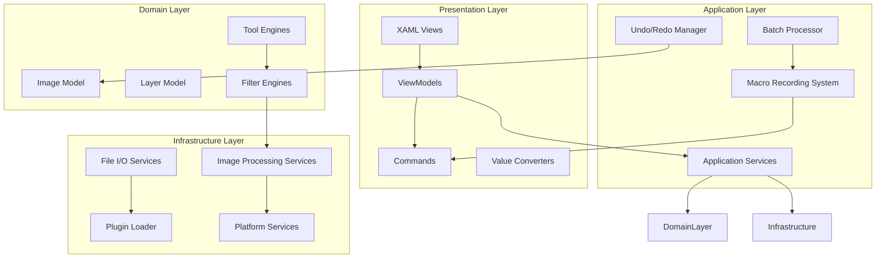
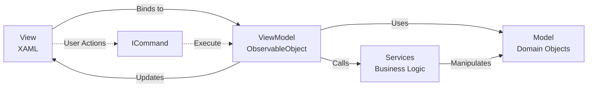
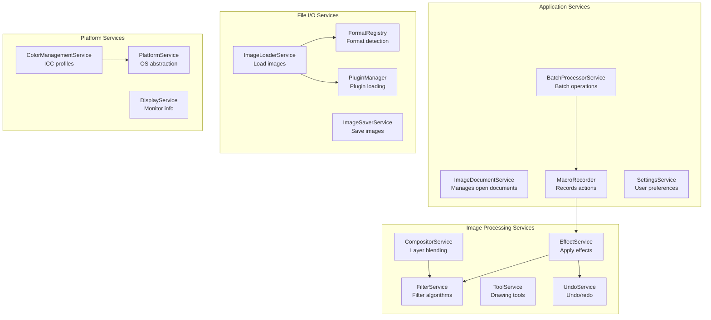
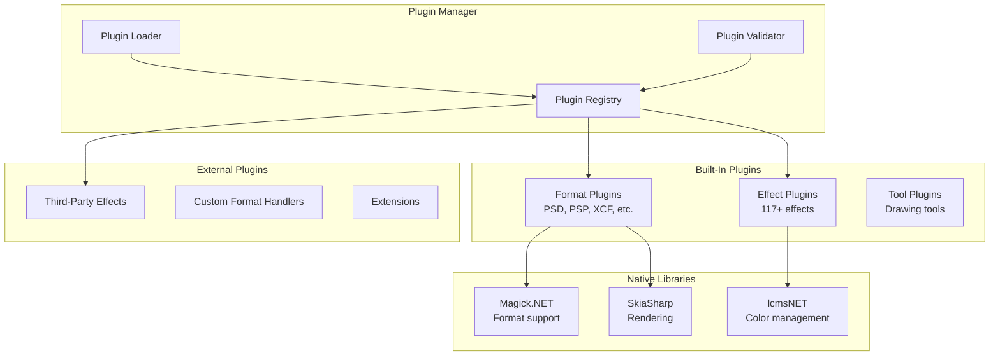
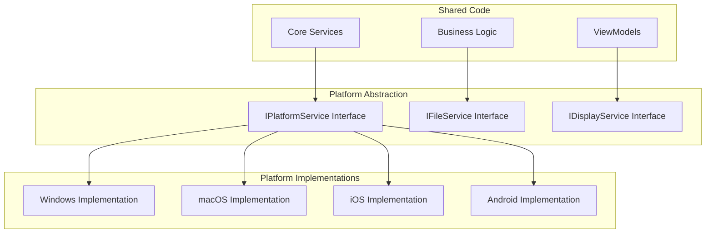

# PhotoDemon .NET 10 MAUI Architecture Design

**Document Version:** 1.0
**Date:** 2025-11-17
**Migration Target:** .NET 10 MAUI
**Author:** Agent 10 - MAUI Architecture Agent
**Status:** Design Complete

---

## Table of Contents

1. [Executive Summary](#executive-summary)
2. [Architecture Overview](#architecture-overview)
3. [MVVM Architecture Design](#mvvm-architecture-design)
4. [Dependency Injection Structure](#dependency-injection-structure)
5. [Service Layer Architecture](#service-layer-architecture)
6. [Plugin Architecture](#plugin-architecture)
7. [Cross-Platform Abstraction](#cross-platform-abstraction)
8. [Project Structure](#project-structure)
9. [Performance Optimization](#performance-optimization)
10. [Memory Management](#memory-management)
11. [Migration Mapping](#migration-mapping)
12. [Implementation Phases](#implementation-phases)

---

## Executive Summary

### Migration Context

PhotoDemon is a sophisticated VB6 image editing application with:
- **527 source files** (114 modules, 141 classes, 216 forms, 56 controls)
- **250,000+ lines of code**
- **117+ image processing effects**
- **40+ import formats, 25+ export formats**
- **56 custom owner-drawn controls**
- **1,493 Windows API declarations**

### Target Architecture

This document defines a modern .NET 10 MAUI architecture that:
- ✅ Preserves PhotoDemon's functionality and feature completeness
- ✅ Enables true cross-platform support (Windows, macOS, iOS, Android, Linux)
- ✅ Improves performance through async/await, SIMD, and GPU acceleration
- ✅ Enhances testability through dependency injection and MVVM
- ✅ Maintains portable/no-install capability
- ✅ Supports 200+ tools and effects with extensible plugin system

### Key Design Principles

1. **MVVM Pattern**: Complete separation of UI and business logic
2. **Clean Architecture**: Feature-based organization with clear boundaries
3. **Dependency Injection**: Loose coupling for testability and extensibility
4. **Async-First**: Non-blocking UI for responsive user experience
5. **Platform Abstraction**: Single codebase with platform-specific implementations
6. **Performance-Focused**: Hardware acceleration, SIMD, streaming for large images
7. **Maintainable**: Clear patterns, comprehensive documentation, automated testing

---

## Architecture Overview

### High-Level Architecture Diagram



### VB6 to MAUI Architecture Mapping

| VB6 Component | VB6 Location | MAUI Equivalent | MAUI Implementation |
|---------------|--------------|-----------------|---------------------|
| **Main.bas** | `/Modules/Main.bas:64` | `MauiProgram.cs` | DI registration, app bootstrap |
| **FormMain** | `/Forms/MainWindow.frm` | `MainPage.xaml` | Shell navigation host |
| **pdImage.cls** | `/Classes/pdImage.cls` | `ImageDocument.cs` | Model with INotifyPropertyChanged |
| **pdDIB.cls** | `/Classes/pdDIB.cls` | `BitmapBuffer.cs` | Unsafe pixel access wrapper |
| **Processor.bas** | `/Modules/Processor.bas` | `CommandDispatcher.cs` | Command pattern with async |
| **pdCommandBar.ctl** | `/Controls/pdCommandBar.ctl` | `CommandBarView.xaml` | MAUI custom control |
| **pdCanvas.ctl** | `/Controls/pdCanvas.ctl` | `ImageCanvasView.xaml` | SkiaSharp-based GraphicsView |
| **Plugin_Management.bas** | `/Modules/Plugin_Management.bas` | `PluginManager.cs` | MEF or reflection-based |

### Technology Stack

| Layer | Technology | Purpose |
|-------|------------|---------|
| **UI Framework** | .NET 10 MAUI | Cross-platform UI |
| **Graphics Engine** | SkiaSharp 2.88.9+ | Hardware-accelerated 2D rendering |
| **Image Processing** | Magick.NET + Custom | Comprehensive format support |
| **Dependency Injection** | Microsoft.Extensions.DI | Built-in DI container |
| **MVVM Framework** | CommunityToolkit.Mvvm | Source-generated MVVM helpers |
| **Navigation** | MAUI Shell | URI-based routing |
| **Data Binding** | MAUI Binding Engine | XAML to ViewModel binding |
| **Async Coordination** | System.Threading.Tasks | Async/await pattern |
| **Serialization** | System.Text.Json | JSON for settings/macros |
| **Platform Services** | MAUI Essentials | Cross-platform APIs |

---

## MVVM Architecture Design

### MVVM Pattern Overview



### View Layer Structure

#### Naming Conventions
- **Pages**: `*Page.xaml` (e.g., `EditorPage.xaml`, `PreferencesPage.xaml`)
- **Views**: `*View.xaml` (e.g., `LayerListView.xaml`, `ToolOptionsView.xaml`)
- **Controls**: `*Control.xaml` (e.g., `SliderControl.xaml`, `ColorSelectorControl.xaml`)
- **Dialogs**: `*Dialog.xaml` (e.g., `ExportDialog.xaml`, `NewImageDialog.xaml`)

#### View Organization

**Reference:** VB6 forms organized in `/home/user/PhotoDemon/Forms/` (216 forms)

**MAUI Structure:**
```
Views/
├── Pages/
│   ├── MainPage.xaml                      # VB6: MainWindow.frm
│   ├── EditorPage.xaml                    # Main image editing surface
│   ├── PreferencesPage.xaml               # VB6: Tools_Options.frm
│   └── BatchProcessPage.xaml              # VB6: File_BatchWizard.frm
├── Panels/
│   ├── LayerPanelView.xaml               # VB6: Layerpanel_Layers.frm
│   ├── ColorPanelView.xaml               # VB6: Layerpanel_Colors.frm
│   ├── NavigatorPanelView.xaml           # VB6: Layerpanel_Navigator.frm
│   └── HistoryPanelView.xaml             # VB6: pdHistory.ctl
├── Toolbars/
│   ├── ToolSelectBar.xaml                # VB6: Toolbar_ToolSelect.frm
│   ├── LayerToolbar.xaml                 # VB6: Toolbar_Layers.frm
│   └── ToolOptionsContainer.xaml         # VB6: Toolbar_ToolOptionsContainer.frm
├── Controls/
│   ├── ImageCanvas/
│   │   ├── ImageCanvasView.xaml          # VB6: pdCanvas.ctl (core canvas)
│   │   └── CanvasOverlay.xaml            # Selection, guides, rulers
│   ├── Input/
│   │   ├── SliderControl.xaml            # VB6: pdSlider.ctl (454 instances)
│   │   ├── ColorSelectorControl.xaml     # VB6: pdColorSelector.ctl
│   │   └── GradientEditorControl.xaml    # VB6: pdGradientSelector.ctl
│   ├── Display/
│   │   ├── EffectPreviewControl.xaml     # VB6: pdFxPreviewCtl (134 instances)
│   │   ├── LayerListControl.xaml         # VB6: pdLayerList.ctl
│   │   └── ColorWheelControl.xaml        # VB6: pdColorWheel.ctl
│   └── Command/
│       ├── CommandBarControl.xaml        # VB6: pdCommandBar.ctl (161 instances)
│       └── ButtonStripControl.xaml       # VB6: pdButtonStrip.ctl (169 instances)
└── Dialogs/
    ├── Effects/
    │   ├── BrightnessContrastDialog.xaml # VB6: Adjustments_BrightnessContrast.frm
    │   ├── CurvesDialog.xaml             # VB6: Adjustments_Curves.frm
    │   └── (113 effect dialogs)          # VB6: 113 effect/adjustment forms
    └── Tools/
        ├── NewImageDialog.xaml           # VB6: File_New.frm
        ├── ResizeDialog.xaml             # VB6: Image_Resize.frm
        └── ExportDialog.xaml             # VB6: File_Export_* forms
```

**Key Mapping:**
- **216 VB6 forms** → ~150-180 XAML views (consolidation where appropriate)
- **56 VB6 custom controls** → ~40-50 MAUI custom controls
- **113 effect dialogs** → Templated dialog system with data-driven UI

### ViewModel Patterns

#### Base ViewModel

```csharp
/// <summary>
/// Base ViewModel providing common functionality
/// Reference: VB6 forms implement common patterns, but no base class
/// </summary>
public abstract partial class ViewModelBase : ObservableObject
{
    protected readonly INavigationService _navigation;
    protected readonly IDialogService _dialogs;

    [ObservableProperty]
    private bool _isBusy;

    [ObservableProperty]
    private string _title;

    protected ViewModelBase(
        INavigationService navigation,
        IDialogService dialogs)
    {
        _navigation = navigation;
        _dialogs = dialogs;
    }

    /// <summary>
    /// Execute async operation with busy indication
    /// </summary>
    protected async Task ExecuteAsync(Func<Task> operation, string? busyMessage = null)
    {
        if (IsBusy) return;

        IsBusy = true;
        try
        {
            await operation();
        }
        catch (Exception ex)
        {
            await _dialogs.ShowErrorAsync("Error", ex.Message);
        }
        finally
        {
            IsBusy = false;
        }
    }
}
```

#### Main ViewModel Example

**Reference:** VB6 MainWindow.frm + PublicVars.bas (global state)

```csharp
/// <summary>
/// Main application ViewModel
/// Replaces: VB6 MainWindow.frm + global state in PublicVars.bas
/// </summary>
public partial class MainViewModel : ViewModelBase
{
    private readonly IImageDocumentService _imageService;
    private readonly IToolService _toolService;
    private readonly IRecentFilesService _recentFiles;

    [ObservableProperty]
    private ObservableCollection<ImageDocumentViewModel> _openImages = new();

    [ObservableProperty]
    private ImageDocumentViewModel? _activeImage;

    [ObservableProperty]
    private ToolType _selectedTool;

    [ObservableProperty]
    private bool _hasOpenImages;

    public MainViewModel(
        INavigationService navigation,
        IDialogService dialogs,
        IImageDocumentService imageService,
        IToolService toolService,
        IRecentFilesService recentFiles)
        : base(navigation, dialogs)
    {
        _imageService = imageService;
        _toolService = toolService;
        _recentFiles = recentFiles;

        Title = "PhotoDemon";
    }

    [RelayCommand]
    private async Task OpenImageAsync()
    {
        var files = await FilePicker.PickMultipleAsync(new PickOptions
        {
            PickerTitle = "Open Image(s)",
            FileTypes = FilePickerFileType.Images
        });

        if (files == null) return;

        await ExecuteAsync(async () =>
        {
            foreach (var file in files)
            {
                var doc = await _imageService.LoadImageAsync(file.FullPath);
                var vm = new ImageDocumentViewModel(doc, _toolService);
                OpenImages.Add(vm);
                ActiveImage = vm;
            }
            HasOpenImages = OpenImages.Any();
        });
    }

    [RelayCommand(CanExecute = nameof(HasOpenImages))]
    private async Task SaveActiveImageAsync()
    {
        if (ActiveImage == null) return;

        await ExecuteAsync(async () =>
        {
            await _imageService.SaveImageAsync(ActiveImage.Document);
        });
    }

    [RelayCommand]
    private async Task ApplyEffectAsync(string effectId)
    {
        if (ActiveImage == null) return;

        // Navigate to effect dialog
        await _navigation.NavigateToAsync($"effect/{effectId}");
    }

    partial void OnActiveImageChanged(ImageDocumentViewModel? value)
    {
        // Update UI when active image changes
        SaveActiveImageCommand.NotifyCanExecuteChanged();
    }
}
```

#### Effect Dialog ViewModel Pattern

**Reference:** VB6 effect dialogs (113 forms in `/home/user/PhotoDemon/Forms/`)

```csharp
/// <summary>
/// Base class for effect dialog ViewModels
/// Replaces: VB6 effect form patterns (e.g., Adjustments_BrightnessContrast.frm)
/// </summary>
public abstract partial class EffectViewModelBase : ViewModelBase
{
    protected readonly IEffectService _effectService;
    protected readonly IUndoService _undoService;

    [ObservableProperty]
    private bool _showPreview = true;

    [ObservableProperty]
    private PreviewMode _previewMode = PreviewMode.Split;

    protected ImageDocument? SourceImage { get; set; }
    protected Layer? SourceLayer { get; set; }

    protected EffectViewModelBase(
        INavigationService navigation,
        IDialogService dialogs,
        IEffectService effectService,
        IUndoService undoService)
        : base(navigation, dialogs)
    {
        _effectService = effectService;
        _undoService = undoService;
    }

    /// <summary>
    /// Apply effect with parameters
    /// Replaces: VB6 cmdBar_OKClick() pattern in effect forms
    /// </summary>
    [RelayCommand]
    protected async Task ApplyAsync()
    {
        if (SourceImage == null) return;

        await ExecuteAsync(async () =>
        {
            // Create undo entry
            await _undoService.CreateUndoAsync(SourceImage, "Effect: " + Title);

            // Apply effect
            var parameters = BuildEffectParameters();
            await _effectService.ApplyEffectAsync(SourceImage, SourceLayer, parameters);

            // Close dialog
            await _navigation.GoBackAsync();
        });
    }

    /// <summary>
    /// Reset parameters to defaults
    /// Replaces: VB6 cmdBar_ResetClick() pattern
    /// </summary>
    [RelayCommand]
    protected virtual void Reset()
    {
        // Override in derived classes to reset parameters
    }

    /// <summary>
    /// Update preview
    /// Replaces: VB6 UpdatePreview() function called on parameter change
    /// </summary>
    protected virtual async Task UpdatePreviewAsync()
    {
        if (!ShowPreview || SourceImage == null) return;

        var parameters = BuildEffectParameters();
        await _effectService.GeneratePreviewAsync(SourceImage, SourceLayer, parameters);
    }

    /// <summary>
    /// Build effect-specific parameters
    /// </summary>
    protected abstract IEffectParameters BuildEffectParameters();
}

/// <summary>
/// Brightness/Contrast dialog ViewModel
/// Replaces: VB6 Adjustments_BrightnessContrast.frm
/// Reference: /home/user/PhotoDemon/Forms/Adjustments_BrightnessContrast.frm:27
/// </summary>
public partial class BrightnessContrastViewModel : EffectViewModelBase
{
    [ObservableProperty]
    [NotifyCanExecuteChangedFor(nameof(ApplyCommand))]
    private int _brightness = 0;  // -255 to 255

    [ObservableProperty]
    [NotifyCanExecuteChangedFor(nameof(ApplyCommand))]
    private int _contrast = 0;    // -100 to 100

    public BrightnessContrastViewModel(
        INavigationService navigation,
        IDialogService dialogs,
        IEffectService effectService,
        IUndoService undoService)
        : base(navigation, dialogs, effectService, undoService)
    {
        Title = "Brightness and Contrast";
    }

    partial void OnBrightnessChanged(int value)
    {
        _ = UpdatePreviewAsync();
    }

    partial void OnContrastChanged(int value)
    {
        _ = UpdatePreviewAsync();
    }

    protected override void Reset()
    {
        Brightness = 0;
        Contrast = 0;
    }

    protected override IEffectParameters BuildEffectParameters()
    {
        return new BrightnessContrastParameters
        {
            Brightness = Brightness,
            Contrast = Contrast
        };
    }
}
```

### Model Layer Design

#### Core Domain Models

**Reference:** VB6 classes in `/home/user/PhotoDemon/Classes/`

```csharp
/// <summary>
/// Image document containing layers and metadata
/// Replaces: VB6 pdImage.cls (/home/user/PhotoDemon/Classes/pdImage.cls:1)
/// </summary>
public class ImageDocument : INotifyPropertyChanged
{
    public string Id { get; init; } = Guid.NewGuid().ToString();
    public string FilePath { get; set; } = string.Empty;
    public string FileName => Path.GetFileName(FilePath);

    public int Width { get; set; }
    public int Height { get; set; }
    public float DpiX { get; set; } = 96f;
    public float DpiY { get; set; } = 96f;

    public ObservableCollection<Layer> Layers { get; } = new();
    public Layer? ActiveLayer { get; set; }

    public ImageMetadata Metadata { get; set; } = new();
    public UndoStack UndoStack { get; } = new();
    public ViewportState Viewport { get; set; } = new();
    public Selection? Selection { get; set; }

    public bool IsDirty { get; set; }
    public bool IsDisposed { get; private set; }

    // Composite buffer for rendering
    public BitmapBuffer? CompositeBuffer { get; set; }

    public event PropertyChangedEventHandler? PropertyChanged;

    /// <summary>
    /// Get composited image (all layers blended)
    /// Replaces: VB6 pdImage.GetCompositedImage()
    /// </summary>
    public async Task<BitmapBuffer> GetCompositedImageAsync()
    {
        // Implementation using compositor service
        throw new NotImplementedException();
    }

    public void Dispose()
    {
        if (IsDisposed) return;

        CompositeBuffer?.Dispose();
        foreach (var layer in Layers)
        {
            layer.Dispose();
        }

        IsDisposed = true;
    }
}

/// <summary>
/// Single layer in image
/// Replaces: VB6 pdLayer.cls (/home/user/PhotoDemon/Classes/pdLayer.cls:1)
/// </summary>
public class Layer : INotifyPropertyChanged, IDisposable
{
    public string Id { get; init; } = Guid.NewGuid().ToString();
    public string Name { get; set; } = "Layer";

    public LayerType Type { get; set; } = LayerType.Raster;
    public BitmapBuffer? LayerDIB { get; set; }

    public float Opacity { get; set; } = 100f;
    public BlendMode BlendMode { get; set; } = BlendMode.Normal;
    public bool Visible { get; set; } = true;

    public LayerTransform Transform { get; set; } = new();
    public LayerMask? Mask { get; set; }

    public event PropertyChangedEventHandler? PropertyChanged;

    public void Dispose()
    {
        LayerDIB?.Dispose();
        Mask?.Dispose();
    }
}

/// <summary>
/// Bitmap buffer for pixel data
/// Replaces: VB6 pdDIB.cls (/home/user/PhotoDemon/Classes/pdDIB.cls:1)
/// </summary>
public class BitmapBuffer : IDisposable
{
    private SKBitmap? _bitmap;
    private byte[]? _pixelData;

    public int Width => _bitmap?.Width ?? 0;
    public int Height => _bitmap?.Height ?? 0;
    public int Stride { get; private set; }
    public SKColorType ColorType { get; set; } = SKColorType.Rgba8888;

    public BitmapBuffer(int width, int height)
    {
        _bitmap = new SKBitmap(width, height, SKColorType.Rgba8888, SKAlphaType.Premul);
        Stride = _bitmap.RowBytes;
    }

    /// <summary>
    /// Get direct pixel access
    /// Replaces: VB6 SafeArray manipulation
    /// </summary>
    public unsafe Span<byte> GetPixelSpan()
    {
        if (_bitmap == null) throw new ObjectDisposedException(nameof(BitmapBuffer));

        IntPtr ptr = _bitmap.GetPixels();
        int length = Height * Stride;
        return new Span<byte>(ptr.ToPointer(), length);
    }

    /// <summary>
    /// Lock pixels for reading/writing
    /// Replaces: VB6 VarPtrArray manipulation
    /// </summary>
    public PixelAccessor LockPixels()
    {
        return new PixelAccessor(_bitmap);
    }

    public void Dispose()
    {
        _bitmap?.Dispose();
        _bitmap = null;
    }
}

/// <summary>
/// Safe pixel accessor with automatic unlock
/// Replaces: VB6 CopyMemory + SafeArray manipulation
/// </summary>
public struct PixelAccessor : IDisposable
{
    private readonly SKBitmap _bitmap;

    internal PixelAccessor(SKBitmap bitmap)
    {
        _bitmap = bitmap;
    }

    public unsafe Span<Rgba32> GetPixels()
    {
        IntPtr ptr = _bitmap.GetPixels();
        int pixelCount = _bitmap.Width * _bitmap.Height;
        return new Span<Rgba32>(ptr.ToPointer(), pixelCount);
    }

    public void Dispose()
    {
        // SkiaSharp doesn't require explicit unlock
    }
}

/// <summary>
/// RGBA pixel structure
/// Replaces: VB6 RGBQuad type (Modules/Drawing2D.bas:312)
/// </summary>
[StructLayout(LayoutKind.Sequential)]
public struct Rgba32
{
    public byte R;
    public byte G;
    public byte B;
    public byte A;

    public Rgba32(byte r, byte g, byte b, byte a = 255)
    {
        R = r;
        G = g;
        B = b;
        A = a;
    }
}
```

### Data Binding Strategies

#### Property Change Notification

```csharp
// Use CommunityToolkit.Mvvm for minimal boilerplate

public partial class LayerViewModel : ObservableObject
{
    // Source generator creates property with notification
    [ObservableProperty]
    private string _name = "Layer";

    [ObservableProperty]
    private float _opacity = 100f;

    [ObservableProperty]
    [NotifyPropertyChangedFor(nameof(IsLayerModifiable))]
    private bool _isLocked;

    // Computed property
    public bool IsLayerModifiable => !IsLocked;
}
```

#### Collection Binding

```csharp
// Use ObservableCollection for automatic UI updates
public partial class LayerPanelViewModel : ViewModelBase
{
    [ObservableProperty]
    private ObservableCollection<LayerViewModel> _layers = new();

    [ObservableProperty]
    private LayerViewModel? _selectedLayer;

    // XAML binds to this collection
    // CollectionView updates automatically on add/remove/reorder
}
```

#### Value Converters

```csharp
/// <summary>
/// Convert opacity (0-100) to alpha (0-1)
/// </summary>
public class OpacityToAlphaConverter : IValueConverter
{
    public object Convert(object value, Type targetType, object parameter, CultureInfo culture)
    {
        if (value is float opacity)
            return opacity / 100.0;
        return 1.0;
    }

    public object ConvertBack(object value, Type targetType, object parameter, CultureInfo culture)
    {
        if (value is double alpha)
            return (float)(alpha * 100.0);
        return 100f;
    }
}
```

---

## Dependency Injection Structure

### Service Registration

**Reference:** VB6 uses global variables in PublicVars.bas; MAUI uses DI container

```csharp
/// <summary>
/// MauiProgram.cs - Application bootstrap
/// Replaces: VB6 Main.bas Main() function (/home/user/PhotoDemon/Modules/Main.bas:64)
/// </summary>
public static class MauiProgram
{
    public static MauiApp CreateMauiApp()
    {
        var builder = MauiApp.CreateBuilder();

        builder
            .UseMauiApp<App>()
            .ConfigureFonts(fonts =>
            {
                fonts.AddFont("OpenSans-Regular.ttf", "OpenSansRegular");
                fonts.AddFont("OpenSans-Semibold.ttf", "OpenSansSemibold");
            })
            .ConfigureEssentials(essentials =>
            {
                essentials.UseVersionTracking();
            });

        // Register Services
        RegisterServices(builder.Services);

        // Register ViewModels
        RegisterViewModels(builder.Services);

        // Register Views
        RegisterViews(builder.Services);

        // Configure handlers (custom controls)
        ConfigureHandlers(builder);

        return builder.Build();
    }

    private static void RegisterServices(IServiceCollection services)
    {
        // Core Services (Singleton - lifetime of app)
        services.AddSingleton<ISettingsService, SettingsService>();
        services.AddSingleton<IThemeService, ThemeService>();
        services.AddSingleton<IRecentFilesService, RecentFilesService>();
        services.AddSingleton<IPluginManager, PluginManager>();
        services.AddSingleton<IMacroRecorder, MacroRecorder>();

        // Document Services (Singleton - manages all open documents)
        services.AddSingleton<IImageDocumentService, ImageDocumentService>();

        // Application Services (Transient - per-operation)
        services.AddTransient<INavigationService, NavigationService>();
        services.AddTransient<IDialogService, DialogService>();
        services.AddTransient<IFileService, FileService>();
        services.AddTransient<IClipboardService, ClipboardService>();

        // Image Processing Services (Transient - per-operation)
        services.AddTransient<IImageLoaderService, ImageLoaderService>();
        services.AddTransient<IImageSaverService, ImageSaverService>();
        services.AddTransient<IEffectService, EffectService>();
        services.AddTransient<IFilterService, FilterService>();
        services.AddTransient<IToolService, ToolService>();
        services.AddTransient<ICompositorService, CompositorService>();
        services.AddTransient<IUndoService, UndoService>();
        services.AddTransient<ISelectionService, SelectionService>();

        // Color Management (Singleton - expensive to initialize)
        services.AddSingleton<IColorManagementService, ColorManagementService>();

        // Platform Services (Singleton - OS integration)
        services.AddSingleton<IPlatformService, PlatformService>();
        services.AddSingleton<IDisplayService, DisplayService>();

        // Batch Processing (Transient)
        services.AddTransient<IBatchProcessorService, BatchProcessorService>();
    }

    private static void RegisterViewModels(IServiceCollection services)
    {
        // Main ViewModels (Singleton - one instance)
        services.AddSingleton<MainViewModel>();
        services.AddSingleton<EditorViewModel>();
        services.AddSingleton<PreferencesViewModel>();

        // Panel ViewModels (Transient - created per panel instance)
        services.AddTransient<LayerPanelViewModel>();
        services.AddTransient<ColorPanelViewModel>();
        services.AddTransient<NavigatorPanelViewModel>();
        services.AddTransient<HistoryPanelViewModel>();

        // Dialog ViewModels (Transient - per dialog instance)
        services.AddTransient<NewImageViewModel>();
        services.AddTransient<ResizeImageViewModel>();
        services.AddTransient<BatchProcessViewModel>();

        // Effect ViewModels (Transient - per effect invocation)
        services.AddTransient<BrightnessContrastViewModel>();
        services.AddTransient<CurvesViewModel>();
        services.AddTransient<LevelsViewModel>();
        // ... (100+ effect ViewModels)
    }

    private static void RegisterViews(IServiceCollection services)
    {
        // Pages
        services.AddTransient<MainPage>();
        services.AddTransient<EditorPage>();
        services.AddTransient<PreferencesPage>();
        services.AddTransient<BatchProcessPage>();

        // Dialogs
        services.AddTransient<NewImageDialog>();
        services.AddTransient<ResizeImageDialog>();
        services.AddTransient<BrightnessContrastDialog>();
        // ... (100+ effect dialogs)
    }

    private static void ConfigureHandlers(MauiAppBuilder builder)
    {
        // Register custom control handlers
        builder.ConfigureMauiHandlers(handlers =>
        {
            handlers.AddHandler<ImageCanvasView, ImageCanvasHandler>();
            handlers.AddHandler<SliderControl, SliderControlHandler>();
            handlers.AddHandler<ColorSelectorControl, ColorSelectorHandler>();
            // ... custom control handlers
        });
    }
}
```

### Service Scopes and Lifetimes

| Service Type | Lifetime | Rationale | VB6 Equivalent |
|--------------|----------|-----------|----------------|
| `ISettingsService` | Singleton | Single settings instance | PublicVars.bas global state |
| `IImageDocumentService` | Singleton | Manages all open documents | PDImages collection |
| `IPluginManager` | Singleton | Expensive initialization | Plugin_Management.bas |
| `IThemeService` | Singleton | App-wide theme state | g_Themer global |
| `INavigationService` | Transient | Per-view navigation | N/A (form-based) |
| `IEffectService` | Transient | Per-effect operation | Processor.bas calls |
| `IFileService` | Transient | Per-operation | Files.bas functions |
| Effect ViewModels | Transient | New instance per dialog | Each form instance |

### Constructor Injection Pattern

```csharp
/// <summary>
/// Example service with dependencies
/// </summary>
public class EffectService : IEffectService
{
    private readonly IImageDocumentService _imageService;
    private readonly IUndoService _undoService;
    private readonly IPluginManager _pluginManager;
    private readonly ILogger<EffectService> _logger;

    public EffectService(
        IImageDocumentService imageService,
        IUndoService undoService,
        IPluginManager pluginManager,
        ILogger<EffectService> logger)
    {
        _imageService = imageService ?? throw new ArgumentNullException(nameof(imageService));
        _undoService = undoService ?? throw new ArgumentNullException(nameof(undoService));
        _pluginManager = pluginManager ?? throw new ArgumentNullException(nameof(pluginManager));
        _logger = logger ?? throw new ArgumentNullException(nameof(logger));
    }

    public async Task ApplyEffectAsync(
        ImageDocument image,
        Layer? layer,
        IEffectParameters parameters,
        CancellationToken cancellationToken = default)
    {
        _logger.LogInformation("Applying effect: {EffectName}", parameters.EffectName);

        // Implementation
    }
}
```

---

## Service Layer Architecture

### Service Organization



### Image Processing Services

#### EffectService

**Reference:** VB6 Processor.bas (/home/user/PhotoDemon/Modules/Processor.bas:1)

```csharp
/// <summary>
/// Central effect processing service
/// Replaces: VB6 Processor.Process() function
/// Reference: /home/user/PhotoDemon/Modules/Processor.bas
/// </summary>
public interface IEffectService
{
    Task ApplyEffectAsync(
        ImageDocument image,
        Layer? targetLayer,
        IEffectParameters parameters,
        IProgress<EffectProgress>? progress = null,
        CancellationToken cancellationToken = default);

    Task<BitmapBuffer> GeneratePreviewAsync(
        ImageDocument image,
        Layer? targetLayer,
        IEffectParameters parameters,
        CancellationToken cancellationToken = default);
}

public class EffectService : IEffectService
{
    private readonly IFilterService _filterService;
    private readonly IUndoService _undoService;
    private readonly IMacroRecorder _macroRecorder;
    private readonly ILogger<EffectService> _logger;

    public EffectService(
        IFilterService filterService,
        IUndoService undoService,
        IMacroRecorder macroRecorder,
        ILogger<EffectService> logger)
    {
        _filterService = filterService;
        _undoService = undoService;
        _macroRecorder = macroRecorder;
        _logger = logger;
    }

    public async Task ApplyEffectAsync(
        ImageDocument image,
        Layer? targetLayer,
        IEffectParameters parameters,
        IProgress<EffectProgress>? progress = null,
        CancellationToken cancellationToken = default)
    {
        _logger.LogInformation("Applying effect: {EffectId}", parameters.EffectId);

        // Create undo entry
        await _undoService.CreateUndoEntryAsync(image, parameters.EffectName);

        // Record macro action
        if (_macroRecorder.IsRecording)
        {
            await _macroRecorder.RecordActionAsync(parameters);
        }

        // Get target layer or active layer
        var layer = targetLayer ?? image.ActiveLayer;
        if (layer == null)
            throw new InvalidOperationException("No target layer");

        // Apply effect based on type
        await ApplyEffectInternalAsync(image, layer, parameters, progress, cancellationToken);

        // Mark image as modified
        image.IsDirty = true;

        // Invalidate composite
        image.CompositeBuffer?.Dispose();
        image.CompositeBuffer = null;
    }

    private async Task ApplyEffectInternalAsync(
        ImageDocument image,
        Layer layer,
        IEffectParameters parameters,
        IProgress<EffectProgress>? progress,
        CancellationToken cancellationToken)
    {
        switch (parameters)
        {
            case BrightnessContrastParameters bc:
                await _filterService.ApplyBrightnessContrastAsync(
                    layer.LayerDIB!, bc.Brightness, bc.Contrast, progress, cancellationToken);
                break;

            case GaussianBlurParameters blur:
                await _filterService.ApplyGaussianBlurAsync(
                    layer.LayerDIB!, blur.Radius, blur.Quality, progress, cancellationToken);
                break;

            // ... 115+ other effects

            default:
                throw new NotSupportedException($"Effect not supported: {parameters.EffectId}");
        }
    }
}
```

#### FilterService

**Reference:** VB6 Filters_*.bas modules (11 filter modules)

```csharp
/// <summary>
/// Low-level filter algorithms
/// Replaces: VB6 Filters_*.bas modules
/// Reference: /home/user/PhotoDemon/Modules/Filters_Area.bas, Filters_Color.bas, etc.
/// </summary>
public interface IFilterService
{
    // Color Adjustments
    Task ApplyBrightnessContrastAsync(
        BitmapBuffer buffer,
        int brightness,
        int contrast,
        IProgress<FilterProgress>? progress = null,
        CancellationToken cancellationToken = default);

    // Blur Operations
    Task ApplyGaussianBlurAsync(
        BitmapBuffer buffer,
        float radius,
        BlurQuality quality = BlurQuality.High,
        IProgress<FilterProgress>? progress = null,
        CancellationToken cancellationToken = default);

    // Edge Detection
    Task ApplySobelEdgeDetectionAsync(
        BitmapBuffer buffer,
        IProgress<FilterProgress>? progress = null,
        CancellationToken cancellationToken = default);

    // Geometric Transforms
    Task ApplyAffineTransformAsync(
        BitmapBuffer buffer,
        Matrix3x2 transform,
        InterpolationMode interpolation = InterpolationMode.Bilinear,
        IProgress<FilterProgress>? progress = null,
        CancellationToken cancellationToken = default);

    // ... 100+ more filter methods
}

public class FilterService : IFilterService
{
    public async Task ApplyBrightnessContrastAsync(
        BitmapBuffer buffer,
        int brightness,
        int contrast,
        IProgress<FilterProgress>? progress = null,
        CancellationToken cancellationToken = default)
    {
        // Build lookup table for performance
        var lut = BuildBrightnessContrastLUT(brightness, contrast);

        // Apply in parallel using Span<T> for performance
        await Task.Run(() =>
        {
            using var accessor = buffer.LockPixels();
            var pixels = accessor.GetPixels();

            Parallel.For(0, pixels.Length, new ParallelOptions
            {
                CancellationToken = cancellationToken
            }, i =>
            {
                ref var pixel = ref pixels[i];
                pixel.R = lut[pixel.R];
                pixel.G = lut[pixel.G];
                pixel.B = lut[pixel.B];

                if (i % 1000 == 0)
                    progress?.Report(new FilterProgress(i, pixels.Length));
            });
        }, cancellationToken);
    }

    private byte[] BuildBrightnessContrastLUT(int brightness, int contrast)
    {
        var lut = new byte[256];
        float contrastFactor = (259f * (contrast + 255f)) / (255f * (259f - contrast));

        for (int i = 0; i < 256; i++)
        {
            // Apply brightness
            float value = i + brightness;

            // Apply contrast
            value = contrastFactor * (value - 128f) + 128f;

            // Clamp
            lut[i] = (byte)Math.Clamp(value, 0, 255);
        }

        return lut;
    }
}
```

### File I/O Services

**Reference:** VB6 ImageLoader.bas, ImageExporter.bas, ImageFormats.bas

```csharp
/// <summary>
/// Image loading service
/// Replaces: VB6 ImageLoader.bas
/// Reference: /home/user/PhotoDemon/Modules/ImageLoader.bas:59
/// </summary>
public interface IImageLoaderService
{
    Task<ImageDocument?> LoadImageAsync(
        string filePath,
        IProgress<LoadProgress>? progress = null,
        CancellationToken cancellationToken = default);

    Task<bool> CanLoadFileAsync(string filePath);

    Task<ImageFormatInfo> DetectFormatAsync(string filePath);
}

public class ImageLoaderService : IImageLoaderService
{
    private readonly IFormatRegistry _formatRegistry;
    private readonly IPluginManager _pluginManager;
    private readonly ILogger<ImageLoaderService> _logger;

    // Format handlers registered by priority
    private readonly List<IImageFormatHandler> _handlers = new();

    public ImageLoaderService(
        IFormatRegistry formatRegistry,
        IPluginManager pluginManager,
        ILogger<ImageLoaderService> logger)
    {
        _formatRegistry = formatRegistry;
        _pluginManager = pluginManager;
        _logger = logger;

        RegisterHandlers();
    }

    private void RegisterHandlers()
    {
        // Priority order: Native parsers → Magick.NET → SkiaSharp

        // Native parsers (highest quality for specific formats)
        _handlers.Add(new PsdFormatHandler());    // VB6: pdPSD.cls
        _handlers.Add(new PspFormatHandler());    // VB6: pdPSP.cls
        _handlers.Add(new XcfFormatHandler());    // VB6: pdXCF.cls
        _handlers.Add(new PngFormatHandler());    // VB6: pdPNG.cls
        _handlers.Add(new GifFormatHandler());    // VB6: pdGIF.cls

        // Magick.NET (comprehensive format support)
        _handlers.Add(new MagickNetFormatHandler());

        // SkiaSharp (fallback for common formats)
        _handlers.Add(new SkiaSharpFormatHandler());
    }

    public async Task<ImageDocument?> LoadImageAsync(
        string filePath,
        IProgress<LoadProgress>? progress = null,
        CancellationToken cancellationToken = default)
    {
        _logger.LogInformation("Loading image: {FilePath}", filePath);

        // Detect format
        var formatInfo = await DetectFormatAsync(filePath);
        progress?.Report(new LoadProgress("Detecting format...", 0));

        // Find handler
        var handler = _handlers.FirstOrDefault(h => h.CanHandle(formatInfo));
        if (handler == null)
        {
            _logger.LogError("No handler for format: {Format}", formatInfo.Extension);
            throw new NotSupportedException($"Format not supported: {formatInfo.Extension}");
        }

        // Load using handler
        progress?.Report(new LoadProgress($"Loading {formatInfo.Extension.ToUpper()}...", 10));
        var document = await handler.LoadAsync(filePath, progress, cancellationToken);

        progress?.Report(new LoadProgress("Load complete", 100));
        return document;
    }
}
```

### Plugin Architecture for Effects

**Reference:** VB6 Plugin_Management.bas (/home/user/PhotoDemon/Modules/Plugin_Management.bas:1)

```csharp
/// <summary>
/// Plugin manager for extensibility
/// Replaces: VB6 Plugin_Management.bas
/// Reference: /home/user/PhotoDemon/Modules/Plugin_Management.bas
/// </summary>
public interface IPluginManager
{
    Task InitializeAsync();

    IEnumerable<IEffectPlugin> GetEffectPlugins();
    IEnumerable<IFormatPlugin> GetFormatPlugins();

    Task<T?> GetPluginAsync<T>(string pluginId) where T : class;
}

public class PluginManager : IPluginManager
{
    private readonly List<IEffectPlugin> _effectPlugins = new();
    private readonly List<IFormatPlugin> _formatPlugins = new();
    private readonly ILogger<PluginManager> _logger;

    public PluginManager(ILogger<PluginManager> logger)
    {
        _logger = logger;
    }

    public async Task InitializeAsync()
    {
        _logger.LogInformation("Initializing plugins...");

        // Load built-in plugins
        await LoadBuiltInPluginsAsync();

        // Load external plugins from Plugins directory
        await LoadExternalPluginsAsync();

        _logger.LogInformation("Loaded {Count} effect plugins", _effectPlugins.Count);
        _logger.LogInformation("Loaded {Count} format plugins", _formatPlugins.Count);
    }

    private async Task LoadBuiltInPluginsAsync()
    {
        // Effect plugins (117+ effects)
        _effectPlugins.Add(new BrightnessContrastPlugin());
        _effectPlugins.Add(new GaussianBlurPlugin());
        _effectPlugins.Add(new CurvesPlugin());
        // ... 114+ more

        await Task.CompletedTask;
    }

    private async Task LoadExternalPluginsAsync()
    {
        var pluginPath = Path.Combine(AppContext.BaseDirectory, "Plugins");
        if (!Directory.Exists(pluginPath))
            return;

        // Load .NET assemblies from Plugins directory
        var assemblies = Directory.GetFiles(pluginPath, "*.dll");

        foreach (var assembly in assemblies)
        {
            try
            {
                await LoadPluginAssemblyAsync(assembly);
            }
            catch (Exception ex)
            {
                _logger.LogError(ex, "Failed to load plugin: {Assembly}", assembly);
            }
        }
    }

    private async Task LoadPluginAssemblyAsync(string assemblyPath)
    {
        // Use reflection to load plugins
        var assembly = Assembly.LoadFrom(assemblyPath);

        var pluginTypes = assembly.GetTypes()
            .Where(t => typeof(IEffectPlugin).IsAssignableFrom(t) && !t.IsAbstract);

        foreach (var type in pluginTypes)
        {
            var plugin = (IEffectPlugin?)Activator.CreateInstance(type);
            if (plugin != null)
            {
                _effectPlugins.Add(plugin);
                _logger.LogInformation("Loaded plugin: {Name}", plugin.Name);
            }
        }

        await Task.CompletedTask;
    }

    public IEnumerable<IEffectPlugin> GetEffectPlugins() => _effectPlugins;
    public IEnumerable<IFormatPlugin> GetFormatPlugins() => _formatPlugins;

    public async Task<T?> GetPluginAsync<T>(string pluginId) where T : class
    {
        if (typeof(T) == typeof(IEffectPlugin))
        {
            return await Task.FromResult(_effectPlugins.FirstOrDefault(p => p.Id == pluginId) as T);
        }

        return null;
    }
}

/// <summary>
/// Plugin interface for effects
/// </summary>
public interface IEffectPlugin
{
    string Id { get; }
    string Name { get; }
    string Category { get; }
    string Description { get; }

    Task<bool> CanApplyAsync(ImageDocument image, Layer? layer);

    Task ApplyAsync(
        ImageDocument image,
        Layer? layer,
        IEffectParameters parameters,
        IProgress<EffectProgress>? progress = null,
        CancellationToken cancellationToken = default);
}
```

---

## Plugin Architecture

### Plugin System Design

**Reference:** VB6 has 18 plugins in `/home/user/PhotoDemon/Modules/Plugin_*.bas`



### Effect Plugin Pattern

```csharp
/// <summary>
/// Example effect plugin implementation
/// </summary>
public class GaussianBlurPlugin : IEffectPlugin
{
    public string Id => "effect_blur_gaussian";
    public string Name => "Gaussian Blur";
    public string Category => "Blur";
    public string Description => "Apply Gaussian blur with configurable radius and quality";

    public Task<bool> CanApplyAsync(ImageDocument image, Layer? layer)
    {
        // Can apply to any raster layer
        layer ??= image.ActiveLayer;
        return Task.FromResult(layer?.Type == LayerType.Raster);
    }

    public async Task ApplyAsync(
        ImageDocument image,
        Layer? layer,
        IEffectParameters parameters,
        IProgress<EffectProgress>? progress = null,
        CancellationToken cancellationToken = default)
    {
        if (parameters is not GaussianBlurParameters blur)
            throw new ArgumentException("Invalid parameters");

        layer ??= image.ActiveLayer;
        if (layer?.LayerDIB == null)
            throw new InvalidOperationException("No target layer");

        // Apply blur algorithm
        await ApplyGaussianBlurAsync(layer.LayerDIB, blur.Radius, blur.Quality, progress, cancellationToken);
    }

    private async Task ApplyGaussianBlurAsync(
        BitmapBuffer buffer,
        float radius,
        BlurQuality quality,
        IProgress<EffectProgress>? progress,
        CancellationToken cancellationToken)
    {
        // Implementation using IIR filter (VB6: Filters_Area.bas:621)
        // Use Deriche or Alvarez-Mazorra algorithm for O(n) performance
        await Task.Run(() =>
        {
            // Gaussian blur implementation
            // Reference VB6: /home/user/PhotoDemon/Modules/Filters_Area.bas:621
        }, cancellationToken);
    }
}
```

### Format Plugin Pattern

```csharp
/// <summary>
/// Format handler interface
/// </summary>
public interface IImageFormatHandler
{
    string Name { get; }
    string[] SupportedExtensions { get; }

    bool CanHandle(ImageFormatInfo formatInfo);

    Task<ImageDocument?> LoadAsync(
        string filePath,
        IProgress<LoadProgress>? progress = null,
        CancellationToken cancellationToken = default);

    Task SaveAsync(
        ImageDocument document,
        string filePath,
        ImageSaveOptions options,
        IProgress<SaveProgress>? progress = null,
        CancellationToken cancellationToken = default);
}

/// <summary>
/// PSD format handler
/// Replaces: VB6 pdPSD.cls (/home/user/PhotoDemon/Classes/pdPSD.cls:1)
/// </summary>
public class PsdFormatHandler : IImageFormatHandler
{
    public string Name => "Adobe Photoshop";
    public string[] SupportedExtensions => new[] { ".psd", ".psb" };

    public bool CanHandle(ImageFormatInfo formatInfo)
    {
        return formatInfo.Extension.ToLower() is ".psd" or ".psb";
    }

    public async Task<ImageDocument?> LoadAsync(
        string filePath,
        IProgress<LoadProgress>? progress = null,
        CancellationToken cancellationToken = default)
    {
        // Port VB6 PSD parser to C#
        // Reference: /home/user/PhotoDemon/Classes/pdPSD.cls
        // - Supports all 9 color modes
        // - 1-32 bits per channel
        // - Layer groups, masks, adjustments
        // - ICC profiles
        // - Apple test suite compliant

        var parser = new PsdParser();
        var document = await parser.LoadAsync(filePath, progress, cancellationToken);
        return document;
    }

    public async Task SaveAsync(
        ImageDocument document,
        string filePath,
        ImageSaveOptions options,
        IProgress<SaveProgress>? progress = null,
        CancellationToken cancellationToken = default)
    {
        var writer = new PsdWriter();
        await writer.SaveAsync(document, filePath, options, progress, cancellationToken);
    }
}
```

---

## Cross-Platform Abstraction

### Platform Service Layer

**Reference:** VB6 is Windows-only; MAUI targets Windows, macOS, iOS, Android, Linux



### Platform-Specific Code Structure

```
Platforms/
├── Android/
│   ├── MainActivity.cs
│   ├── Services/
│   │   ├── PlatformService.cs
│   │   ├── FileService.cs
│   │   └── DisplayService.cs
│   └── Resources/
├── iOS/
│   ├── AppDelegate.cs
│   ├── Services/
│   │   ├── PlatformService.cs
│   │   ├── FileService.cs
│   │   └── DisplayService.cs
│   └── Resources/
├── MacCatalyst/
│   ├── AppDelegate.cs
│   ├── Services/
│   │   ├── PlatformService.cs
│   │   ├── FileService.cs
│   │   └── DisplayService.cs
│   └── Resources/
└── Windows/
    ├── App.xaml.cs
    ├── Services/
    │   ├── PlatformService.cs
    │   ├── FileService.cs
    │   └── DisplayService.cs
    └── Resources/
```

### Platform Service Interface

```csharp
/// <summary>
/// Platform abstraction service
/// Replaces: VB6 OS.bas, platform-specific API calls
/// Reference: /home/user/PhotoDemon/Modules/OS.bas
/// </summary>
public interface IPlatformService
{
    PlatformType Platform { get; }
    string PlatformVersion { get; }

    Task<MemoryInfo> GetMemoryInfoAsync();
    Task<CpuInfo> GetCpuInfoAsync();
    Task<DisplayInfo[]> GetDisplaysAsync();

    string GetTempPath();
    string GetUserDataPath();
    string GetAppDataPath();

    bool SupportsHardwareAcceleration { get; }
    bool SupportsMultiWindow { get; }
}

/// <summary>
/// Windows-specific implementation
/// </summary>
public partial class PlatformService : IPlatformService
{
    public PlatformType Platform => PlatformType.Windows;

    public string PlatformVersion => Environment.OSVersion.VersionString;

#if WINDOWS
    public async Task<MemoryInfo> GetMemoryInfoAsync()
    {
        // Use Windows-specific APIs
        // Replaces: VB6 OS_MemoryStatusEx in /home/user/PhotoDemon/Modules/OS.bas:210

        var memStatus = new Native.MEMORYSTATUSEX();
        memStatus.dwLength = (uint)Marshal.SizeOf(memStatus);

        if (Native.GlobalMemoryStatusEx(ref memStatus))
        {
            return new MemoryInfo
            {
                TotalPhysical = (long)memStatus.ullTotalPhys,
                AvailablePhysical = (long)memStatus.ullAvailPhys,
                TotalVirtual = (long)memStatus.ullTotalVirtual,
                AvailableVirtual = (long)memStatus.ullAvailVirtual
            };
        }

        return new MemoryInfo();
    }

    [StructLayout(LayoutKind.Sequential)]
    private struct MEMORYSTATUSEX
    {
        public uint dwLength;
        public uint dwMemoryLoad;
        public ulong ullTotalPhys;
        public ulong ullAvailPhys;
        public ulong ullTotalPageFile;
        public ulong ullAvailPageFile;
        public ulong ullTotalVirtual;
        public ulong ullAvailVirtual;
        public ulong ullAvailExtendedVirtual;
    }

    [DllImport("kernel32.dll", SetLastError = true)]
    [return: MarshalAs(UnmanagedType.Bool)]
    private static extern bool GlobalMemoryStatusEx(ref MEMORYSTATUSEX lpBuffer);
#endif
}
```

### Conditional Compilation Strategy

```csharp
/// <summary>
/// File service with platform-specific implementations
/// </summary>
public partial class FileService : IFileService
{
    public async Task<string?> PickImageFileAsync()
    {
#if WINDOWS
        // Use Windows file picker
        var picker = new Windows.Storage.Pickers.FileOpenPicker
        {
            SuggestedStartLocation = Windows.Storage.Pickers.PickerLocationId.PicturesLibrary
        };
        picker.FileTypeFilter.Add(".jpg");
        picker.FileTypeFilter.Add(".png");
        // ... add all 40+ supported formats

        var file = await picker.PickSingleFileAsync();
        return file?.Path;

#elif ANDROID || IOS || MACCATALYST
        // Use MAUI FilePicker
        var result = await FilePicker.PickAsync(new PickOptions
        {
            PickerTitle = "Select an image",
            FileTypes = FilePickerFileType.Images
        });

        return result?.FullPath;

#else
        throw new PlatformNotSupportedException();
#endif
    }
}
```

### Resource Management Per Platform

```xml
<!-- Windows-specific resources -->
<OnPlatform x:TypeArguments="x:Double" x:Key="ToolbarHeight">
    <On Platform="Windows">44</On>
    <On Platform="Android">56</On>
    <On Platform="iOS">44</On>
</OnPlatform>

<!-- Platform-specific styles -->
<Style x:Key="ButtonStyle" TargetType="Button">
    <Setter Property="CornerRadius">
        <Setter.Value>
            <OnPlatform x:TypeArguments="x:Int32">
                <On Platform="Windows">4</On>
                <On Platform="Android">8</On>
                <On Platform="iOS">8</On>
            </OnPlatform>
        </Setter.Value>
    </Setter>
</Style>
```

---

## Project Structure

### Solution Organization

```
PhotoDemon.sln
├── src/
│   ├── PhotoDemon.Core/                    # Shared core library
│   │   ├── Models/                        # Domain models
│   │   │   ├── ImageDocument.cs           # VB6: pdImage.cls
│   │   │   ├── Layer.cs                   # VB6: pdLayer.cls
│   │   │   ├── BitmapBuffer.cs            # VB6: pdDIB.cls
│   │   │   └── Selection.cs               # VB6: pdSelection.cls
│   │   ├── Algorithms/                    # Filter implementations
│   │   │   ├── ColorFilters.cs            # VB6: Filters_Color.bas
│   │   │   ├── BlurFilters.cs             # VB6: Filters_Area.bas
│   │   │   ├── EdgeFilters.cs             # VB6: Filters_Edge.bas
│   │   │   └── (11 filter modules)        # VB6: 11 Filters_*.bas
│   │   ├── FileFormats/                   # Format parsers
│   │   │   ├── Psd/
│   │   │   │   ├── PsdParser.cs           # VB6: pdPSD.cls
│   │   │   │   └── PsdWriter.cs
│   │   │   ├── Psp/
│   │   │   │   ├── PspParser.cs           # VB6: pdPSP.cls
│   │   │   │   └── PspWriter.cs
│   │   │   ├── Xcf/
│   │   │   │   └── XcfParser.cs           # VB6: pdXCF.cls
│   │   │   └── (15+ format parsers)       # VB6: 15 format classes
│   │   └── Utilities/
│   │       ├── ColorSpaces.cs             # VB6: Colors.bas
│   │       ├── MathHelpers.cs             # VB6: PDMath.bas
│   │       └── StringHelpers.cs           # VB6: Strings.bas
│   │
│   ├── PhotoDemon.Services/               # Business logic services
│   │   ├── Interfaces/
│   │   │   ├── IImageProcessingService.cs
│   │   │   ├── IEffectService.cs
│   │   │   ├── IFileService.cs
│   │   │   └── (20+ service interfaces)
│   │   ├── Implementations/
│   │   │   ├── ImageDocumentService.cs    # VB6: PDImages.bas
│   │   │   ├── EffectService.cs           # VB6: Processor.bas
│   │   │   ├── FilterService.cs           # VB6: Filters_*.bas
│   │   │   ├── UndoService.cs             # VB6: pdUndo.cls
│   │   │   └── (20+ service implementations)
│   │   └── Plugins/
│   │       ├── PluginManager.cs           # VB6: Plugin_Management.bas
│   │       ├── EffectPlugins/
│   │       └── FormatPlugins/
│   │
│   ├── PhotoDemon.Maui/                   # MAUI application
│   │   ├── MauiProgram.cs                 # DI registration
│   │   ├── App.xaml                       # Application entry
│   │   ├── AppShell.xaml                  # Navigation shell
│   │   ├── ViewModels/
│   │   │   ├── MainViewModel.cs           # VB6: MainWindow.frm logic
│   │   │   ├── EditorViewModel.cs
│   │   │   ├── Effects/                   # 117+ effect ViewModels
│   │   │   │   ├── BrightnessContrastViewModel.cs
│   │   │   │   └── (116+ effect VMs)
│   │   │   └── Panels/
│   │   │       ├── LayerPanelViewModel.cs
│   │   │       └── ColorPanelViewModel.cs
│   │   ├── Views/
│   │   │   ├── Pages/
│   │   │   │   ├── MainPage.xaml          # VB6: MainWindow.frm
│   │   │   │   └── EditorPage.xaml
│   │   │   ├── Panels/
│   │   │   │   ├── LayerPanelView.xaml    # VB6: Layerpanel_Layers.frm
│   │   │   │   └── ColorPanelView.xaml
│   │   │   ├── Controls/
│   │   │   │   ├── ImageCanvas/
│   │   │   │   │   └── ImageCanvasView.xaml  # VB6: pdCanvas.ctl
│   │   │   │   ├── Input/
│   │   │   │   │   ├── SliderControl.xaml    # VB6: pdSlider.ctl
│   │   │   │   │   └── ColorSelectorControl.xaml
│   │   │   │   └── (40+ custom controls)     # VB6: 56 controls
│   │   │   └── Dialogs/
│   │   │       ├── Effects/                   # 113 effect dialogs
│   │   │       └── Tools/
│   │   ├── Handlers/                      # Custom control handlers
│   │   ├── Converters/                    # Value converters
│   │   ├── Behaviors/                     # XAML behaviors
│   │   ├── Resources/
│   │   │   ├── Styles/
│   │   │   ├── Images/
│   │   │   └── Fonts/
│   │   └── Platforms/
│   │       ├── Android/
│   │       ├── iOS/
│   │       ├── MacCatalyst/
│   │       └── Windows/
│   │
│   └── PhotoDemon.Controls/               # Reusable control library
│       ├── ImageCanvas.cs
│       ├── Slider.cs
│       ├── ColorSelector.cs
│       └── (40+ controls)
│
├── tests/
│   ├── PhotoDemon.Core.Tests/
│   ├── PhotoDemon.Services.Tests/
│   └── PhotoDemon.Maui.Tests/
│
└── docs/
    ├── architecture/
    ├── api/
    └── migration/
```

### Namespace Organization

```csharp
// Core Models
PhotoDemon.Core.Models
PhotoDemon.Core.Models.Layers
PhotoDemon.Core.Models.Effects

// Algorithms
PhotoDemon.Core.Algorithms.Filters
PhotoDemon.Core.Algorithms.ColorSpaces
PhotoDemon.Core.Algorithms.Transforms

// File Formats
PhotoDemon.Core.FileFormats
PhotoDemon.Core.FileFormats.Psd
PhotoDemon.Core.FileFormats.Png

// Services
PhotoDemon.Services
PhotoDemon.Services.ImageProcessing
PhotoDemon.Services.FileIO
PhotoDemon.Services.Plugins

// MAUI App
PhotoDemon.Maui
PhotoDemon.Maui.ViewModels
PhotoDemon.Maui.Views
PhotoDemon.Maui.Services

// Platform-specific
PhotoDemon.Maui.Platforms.Windows
PhotoDemon.Maui.Platforms.Android
```

---

## Performance Optimization

### Async-First Design

**Reference:** VB6 is synchronous; .NET MAUI requires async for UI responsiveness

```csharp
/// <summary>
/// All long-running operations must be async
/// </summary>
public class PerformancePatterns
{
    // ✅ GOOD: Async operation with progress reporting
    public async Task<BitmapBuffer> ApplyGaussianBlurAsync(
        BitmapBuffer source,
        float radius,
        IProgress<double>? progress = null,
        CancellationToken cancellationToken = default)
    {
        return await Task.Run(() =>
        {
            // CPU-intensive work on background thread
            var result = new BitmapBuffer(source.Width, source.Height);

            // ... blur algorithm with progress reporting
            for (int i = 0; i < iterations; i++)
            {
                if (cancellationToken.IsCancellationRequested)
                    throw new OperationCanceledException();

                progress?.Report((double)i / iterations);
            }

            return result;
        }, cancellationToken);
    }

    // ❌ BAD: Synchronous blocking operation
    public BitmapBuffer ApplyGaussianBlurSync(BitmapBuffer source, float radius)
    {
        // Blocks UI thread - DO NOT DO THIS
        Thread.Sleep(5000); // Simulating long operation
        return source;
    }
}
```

### SIMD Optimizations

**Reference:** VB6 has no SIMD; .NET has System.Numerics.Vector

```csharp
/// <summary>
/// Use SIMD for performance-critical pixel operations
/// </summary>
public static class SimdOptimizations
{
    /// <summary>
    /// Apply brightness adjustment using SIMD
    /// 4-8x faster than scalar code
    /// </summary>
    public static unsafe void ApplyBrightness(Span<byte> pixels, int brightness)
    {
        int simdLength = Vector<byte>.Count;
        int i = 0;

        // Process in SIMD chunks
        for (; i <= pixels.Length - simdLength; i += simdLength)
        {
            var chunk = new Vector<byte>(pixels.Slice(i, simdLength));
            var adjusted = Vector.Add(chunk, new Vector<byte>((byte)brightness));
            adjusted.CopyTo(pixels.Slice(i));
        }

        // Process remaining pixels
        for (; i < pixels.Length; i++)
        {
            pixels[i] = (byte)Math.Clamp(pixels[i] + brightness, 0, 255);
        }
    }
}
```

### Parallel Processing

**Reference:** VB6 has limited threading; .NET has excellent parallelization

```csharp
/// <summary>
/// Parallel image processing
/// </summary>
public static class ParallelProcessing
{
    /// <summary>
    /// Apply filter to image using parallel processing
    /// Scales to available CPU cores
    /// </summary>
    public static void ApplyFilterParallel(
        BitmapBuffer buffer,
        Func<Rgba32, Rgba32> filterFunc)
    {
        using var accessor = buffer.LockPixels();
        var pixels = accessor.GetPixels();

        // Partition work across CPU cores
        Parallel.For(0, buffer.Height, y =>
        {
            int rowStart = y * buffer.Width;
            int rowEnd = rowStart + buffer.Width;

            for (int i = rowStart; i < rowEnd; i++)
            {
                pixels[i] = filterFunc(pixels[i]);
            }
        });
    }
}
```

### GPU Acceleration with SkiaSharp

```csharp
/// <summary>
/// GPU-accelerated rendering
/// </summary>
public class GpuAcceleratedCanvas : GraphicsView, IDrawable
{
    private GRContext? _grContext;

    public void Draw(ICanvas canvas, RectF dirtyRect)
    {
        if (canvas is SkiaCanvas skiaCanvas)
        {
            var skCanvas = skiaCanvas.Canvas;
            var surface = skCanvas.Surface;

            // GPU-accelerated operations
            using var paint = new SKPaint
            {
                IsAntialias = true,
                FilterQuality = SKFilterQuality.High
            };

            // Draw using GPU
            skCanvas.DrawBitmap(_bitmap, 0, 0, paint);
        }
    }
}
```

### Caching Strategies

**Reference:** VB6 caches composite buffer; MAUI should do the same

```csharp
/// <summary>
/// Multi-level caching for performance
/// Replaces: VB6 CompositeBuffer caching in pdImage.cls
/// </summary>
public class ImageCacheStrategy
{
    private readonly MemoryCache _cache = new MemoryCache(new MemoryCacheOptions
    {
        SizeLimit = 500 * 1024 * 1024 // 500 MB cache
    });

    /// <summary>
    /// Get composited image with caching
    /// </summary>
    public async Task<BitmapBuffer> GetCompositedImageAsync(ImageDocument document)
    {
        string cacheKey = $"composite_{document.Id}_{document.GetHashCode()}";

        if (_cache.TryGetValue<BitmapBuffer>(cacheKey, out var cached))
        {
            return cached;
        }

        // Compose layers
        var composite = await ComposeLayersAsync(document);

        // Cache with eviction policy
        var cacheOptions = new MemoryCacheEntryOptions()
            .SetSize(composite.Width * composite.Height * 4)
            .SetSlidingExpiration(TimeSpan.FromMinutes(5))
            .RegisterPostEvictionCallback((key, value, reason, state) =>
            {
                (value as IDisposable)?.Dispose();
            });

        _cache.Set(cacheKey, composite, cacheOptions);

        return composite;
    }
}
```

### Lazy Loading

```csharp
/// <summary>
/// Lazy load effects and plugins
/// </summary>
public class LazyLoadingPattern
{
    // Lazy initialization of expensive resources
    private readonly Lazy<IFilterService> _filterService;
    private readonly Lazy<ICompositorService> _compositor;

    public LazyLoadingPattern(
        IServiceProvider serviceProvider)
    {
        _filterService = new Lazy<IFilterService>(() =>
            serviceProvider.GetRequiredService<IFilterService>());

        _compositor = new Lazy<ICompositorService>(() =>
            serviceProvider.GetRequiredService<ICompositorService>());
    }

    public IFilterService FilterService => _filterService.Value;
    public ICompositorService Compositor => _compositor.Value;
}
```

---

## Memory Management

### Large Image Handling

**Reference:** VB6 pdDIB.cls supports memory/disk suspension for large images

```csharp
/// <summary>
/// Streaming large images to avoid memory issues
/// Replaces: VB6 pdDIB memory suspension (/home/user/PhotoDemon/Classes/pdDIB.cls)
/// </summary>
public class LargeImageHandler
{
    private const long MaxMemorySize = 500 * 1024 * 1024; // 500 MB

    /// <summary>
    /// Load large image with streaming
    /// </summary>
    public async Task<ImageDocument> LoadLargeImageAsync(
        string filePath,
        CancellationToken cancellationToken = default)
    {
        var fileInfo = new FileInfo(filePath);

        if (fileInfo.Length > MaxMemorySize)
        {
            // Use streaming for very large files
            return await LoadWithStreamingAsync(filePath, cancellationToken);
        }
        else
        {
            // Load entire file into memory
            return await LoadInMemoryAsync(filePath, cancellationToken);
        }
    }

    private async Task<ImageDocument> LoadWithStreamingAsync(
        string filePath,
        CancellationToken cancellationToken)
    {
        // Implement tiled loading for large images
        // Load and process image in tiles to reduce memory usage

        using var stream = File.OpenRead(filePath);
        // ... streaming implementation

        throw new NotImplementedException();
    }
}
```

### IDisposable Pattern

```csharp
/// <summary>
/// Proper resource cleanup
/// </summary>
public class ResourceManagement : IDisposable
{
    private BitmapBuffer? _buffer;
    private SKBitmap? _bitmap;
    private bool _disposed;

    public void Dispose()
    {
        Dispose(true);
        GC.SuppressFinalize(this);
    }

    protected virtual void Dispose(bool disposing)
    {
        if (_disposed) return;

        if (disposing)
        {
            // Dispose managed resources
            _buffer?.Dispose();
            _bitmap?.Dispose();
        }

        // Free unmanaged resources
        // (none in this example)

        _disposed = true;
    }

    ~ResourceManagement()
    {
        Dispose(false);
    }
}
```

### Span<T> and Memory<T>

```csharp
/// <summary>
/// Use Span<T> for zero-allocation pixel access
/// Replaces: VB6 SafeArray manipulation
/// </summary>
public class SpanBasedProcessing
{
    /// <summary>
    /// Process pixels without allocation
    /// </summary>
    public void ProcessPixels(BitmapBuffer buffer)
    {
        Span<Rgba32> pixels = buffer.GetPixelSpan();

        // Process in-place without allocation
        for (int i = 0; i < pixels.Length; i++)
        {
            ref var pixel = ref pixels[i];
            pixel.R = (byte)(255 - pixel.R);
            pixel.G = (byte)(255 - pixel.G);
            pixel.B = (byte)(255 - pixel.B);
        }
    }

    /// <summary>
    /// Stack allocation for small arrays
    /// </summary>
    public void UseStackAllocation()
    {
        Span<byte> lut = stackalloc byte[256];

        // Build lookup table on stack (no heap allocation)
        for (int i = 0; i < 256; i++)
        {
            lut[i] = (byte)(255 - i);
        }
    }
}
```

---

## Migration Mapping

### Major Component Mapping

| VB6 Component | File Reference | MAUI Component | Implementation Notes |
|---------------|----------------|----------------|---------------------|
| **Application Entry** |
| `Main.bas` | `/Modules/Main.bas:64` | `MauiProgram.cs` | DI registration, app bootstrap |
| **Main Window** |
| `MainWindow.frm` | `/Forms/MainWindow.frm:1` | `MainPage.xaml` + `MainViewModel.cs` | Shell-based navigation |
| **Image Canvas** |
| `pdCanvas.ctl` | `/Controls/pdCanvas.ctl:27` | `ImageCanvasView.xaml` | SkiaSharp GraphicsView |
| **Data Model** |
| `pdImage.cls` | `/Classes/pdImage.cls:1` | `ImageDocument.cs` | Model with INotifyPropertyChanged |
| `pdLayer.cls` | `/Classes/pdLayer.cls:1` | `Layer.cs` | Layer model |
| `pdDIB.cls` | `/Classes/pdDIB.cls:1` | `BitmapBuffer.cs` | Span<T>-based pixel access |
| `pdSelection.cls` | `/Classes/pdSelection.cls:1` | `Selection.cs` | Selection model |
| **Processing** |
| `Processor.bas` | `/Modules/Processor.bas:1` | `EffectService.cs` | Async command pattern |
| `Filters_Area.bas` | `/Modules/Filters_Area.bas:1` | `BlurFilters.cs` | IIR blur algorithms |
| `Filters_Color.bas` | `/Modules/Filters_Color.bas:20` | `ColorFilters.cs` | Color adjustment algorithms |
| **File I/O** |
| `ImageLoader.bas` | `/Modules/ImageLoader.bas:59` | `ImageLoaderService.cs` | Format detection and loading |
| `ImageExporter.bas` | `/Modules/ImageExporter.bas:1` | `ImageSaverService.cs` | Format-specific saving |
| `pdPSD.cls` | `/Classes/pdPSD.cls:1` | `PsdParser.cs` + `PsdWriter.cs` | Port to C# |
| `pdPSP.cls` | `/Classes/pdPSP.cls:1` | `PspParser.cs` + `PspWriter.cs` | Port to C# |
| **Controls** |
| `pdSlider.ctl` | `/Controls/pdSlider.ctl:59` (454 uses) | `SliderControl.xaml` | Custom MAUI control |
| `pdCommandBar.ctl` | `/Controls/pdCommandBar.ctl:135` (161 uses) | `CommandBarControl.xaml` | Composite control |
| `pdFxPreviewCtl` | `/Controls/pdFxPreview.ctl:60` (134 uses) | `EffectPreviewControl.xaml` | SkiaSharp preview |
| `pdLayerList.ctl` | `/Controls/pdLayerList.ctl:49` | `LayerListControl.xaml` | CollectionView-based |
| **Plugins** |
| `Plugin_Management.bas` | `/Modules/Plugin_Management.bas:1` | `PluginManager.cs` | Reflection-based loading |
| **Macro System** |
| `BatchProcessor.bas` | `/Modules/BatchProcessor.bas:70` | `MacroRecorder.cs` | JSON serialization |
| **Undo/Redo** |
| `pdUndo.cls` | `/Classes/pdUndo.cls:1` | `UndoService.cs` | Command pattern with stack |

### Effect Dialog Mapping

**All 113 VB6 effect dialogs** follow this pattern:

| VB6 Pattern | MAUI Pattern |
|-------------|--------------|
| `Adjustments_*.frm` | `*Dialog.xaml` + `*ViewModel.cs` |
| `Effects_*_*.frm` | `*Dialog.xaml` + `*ViewModel.cs` |
| Effect parameters in form controls | Data-bound properties in ViewModel |
| `cmdBar_OKClick()` | `ApplyCommand` in ViewModel |
| `cmdBar_ResetClick()` | `ResetCommand` in ViewModel |
| `UpdatePreview()` | `UpdatePreviewAsync()` triggered by property changes |

**Example Mapping:**

| VB6 Form | MAUI Implementation |
|----------|---------------------|
| `/Forms/Adjustments_BrightnessContrast.frm:27` | `BrightnessContrastDialog.xaml` + `BrightnessContrastViewModel.cs` |
| `/Forms/Adjustments_Curves.frm` | `CurvesDialog.xaml` + `CurvesViewModel.cs` |
| `/Forms/Effects_Blur_GaussianBlur.frm` | `GaussianBlurDialog.xaml` + `GaussianBlurViewModel.cs` |

---

## Implementation Phases

### Phase 1: Foundation (Months 1-3)

**Goal:** Core infrastructure and basic functionality

**Tasks:**
1. **Project Setup**
   - Create .NET 10 MAUI solution structure
   - Set up dependency injection in `MauiProgram.cs`
   - Configure CI/CD pipeline

2. **Core Models**
   - Implement `ImageDocument`, `Layer`, `BitmapBuffer`
   - Port `pdDIB.cls` pixel access patterns to `Span<T>`
   - Implement `Selection`, `ViewportState`

3. **Basic Services**
   - `IImageDocumentService` - Document management
   - `IFileService` - File picker integration
   - `INavigationService` - MAUI Shell navigation
   - `ISettingsService` - User preferences

4. **Basic UI**
   - `MainPage.xaml` - Shell navigation host
   - `EditorPage.xaml` - Image editor surface
   - `ImageCanvasView.xaml` - SkiaSharp-based canvas
   - Basic menu structure

**Deliverables:**
- ✅ Application launches on Windows, macOS
- ✅ Can open and display a single image
- ✅ Basic zoom and pan
- ✅ DI container configured

**Estimated Effort:** 3 months, 2 developers

---

### Phase 2: Image Processing Core (Months 4-6)

**Goal:** Core image processing and effects

**Tasks:**
1. **Filter Service**
   - Port `Filters_Color.bas` - Color adjustments
   - Port `Filters_Area.bas` - Blur/sharpen with IIR
   - Port `Filters_Edge.bas` - Edge detection
   - Implement 20-30 most-used effects

2. **Effect Service**
   - `IEffectService` - Effect dispatcher
   - Effect parameter system
   - Progress reporting
   - Async execution

3. **Undo/Redo**
   - `IUndoService` - Command pattern
   - Diff-based undo (like VB6)
   - Undo stack per document

4. **Effect Dialogs**
   - Template-based dialog system
   - Implement 30 most-used effect dialogs
   - Real-time preview with `EffectPreviewControl`

**Deliverables:**
- ✅ 30+ effects working
- ✅ Effect dialogs with preview
- ✅ Undo/redo functional
- ✅ Performance benchmarked

**Estimated Effort:** 3 months, 3 developers

---

### Phase 3: File Formats (Months 7-9)

**Goal:** Comprehensive format support

**Tasks:**
1. **Format Infrastructure**
   - `IImageLoaderService` - Multi-format loading
   - `IImageSaverService` - Multi-format saving
   - `IFormatRegistry` - Format detection
   - Plugin architecture

2. **Native Parsers** (Port from VB6)
   - **PSD Parser** - Port `pdPSD.cls` (highest priority)
   - **PSP Parser** - Port `pdPSP.cls`
   - **XCF Parser** - Port `pdXCF.cls`
   - **PNG Parser** - Port `pdPNG.cls` (APNG support)
   - **GIF Parser** - Port `pdGIF.cls`

3. **Library Integration**
   - Magick.NET integration (100+ formats)
   - SkiaSharp integration (common formats)
   - Format-specific save dialogs

4. **Export Dialogs**
   - 25+ export format dialogs
   - Format-specific options
   - Quality settings

**Deliverables:**
- ✅ 40+ import formats supported
- ✅ 25+ export formats supported
- ✅ PSD/PSP/XCF fully functional
- ✅ Export dialogs complete

**Estimated Effort:** 3 months, 2 developers (parsers are complex)

---

### Phase 4: Advanced UI (Months 10-12)

**Goal:** Complete custom control library

**Tasks:**
1. **Input Controls**
   - `SliderControl` (VB6: pdSlider, 454 uses)
   - `ColorSelectorControl` (VB6: pdColorSelector)
   - `GradientEditorControl` (VB6: pdGradientSelector)
   - `SpinnerControl`, `ButtonStripControl`

2. **Display Controls**
   - `LayerListControl` (VB6: pdLayerList)
   - `ColorWheelControl` (VB6: pdColorWheel)
   - `NavigatorControl` (VB6: pdNavigator)
   - `HistoryControl` (VB6: pdHistory)

3. **Command Controls**
   - `CommandBarControl` (VB6: pdCommandBar, 161 uses)
   - `ToolbarControls`

4. **Panels**
   - Layer panel
   - Color panel
   - Navigator panel
   - History panel

**Deliverables:**
- ✅ 40+ custom controls
- ✅ All panels functional
- ✅ UI matches VB6 feature parity

**Estimated Effort:** 3 months, 2-3 developers

---

### Phase 5: Tools & Selection (Months 13-15)

**Goal:** Drawing tools and selection system

**Tasks:**
1. **Selection System**
   - `ISelectionService`
   - Rectangle, ellipse, lasso, polygon selections
   - Selection rendering overlay
   - Selection operations (grow, shrink, feather)

2. **Drawing Tools**
   - Paintbrush tool
   - Pencil tool
   - Fill tool
   - Gradient tool
   - Clone stamp tool

3. **Transform Tools**
   - Move/resize tool
   - Rotate tool
   - Crop tool

**Deliverables:**
- ✅ All selection types working
- ✅ 10+ drawing tools
- ✅ Transform tools complete

**Estimated Effort:** 3 months, 2 developers

---

### Phase 6: Remaining Effects (Months 16-18)

**Goal:** Complete all 117+ effects

**Tasks:**
1. **Port Remaining Effects**
   - Artistic effects (12)
   - Distortion effects (12)
   - Natural effects (7)
   - Noise effects (8)
   - All remaining categories

2. **Advanced Algorithms**
   - Anisotropic diffusion
   - Mean shift
   - Kuwahara filter
   - Complex distortions (Droste, etc.)

3. **Effect Dialogs**
   - Complete all 113 effect dialogs
   - Preset system
   - Randomization UI

**Deliverables:**
- ✅ All 117+ effects implemented
- ✅ All effect dialogs complete
- ✅ Performance optimized

**Estimated Effort:** 3 months, 2-3 developers

---

### Phase 7: Macro & Batch (Months 19-20)

**Goal:** Automation systems

**Tasks:**
1. **Macro Recording**
   - `IMacroRecorder` service
   - Action capture system
   - JSON serialization (VB6: XML)
   - Playback engine

2. **Batch Processing**
   - Batch wizard UI
   - Multi-file processing
   - Progress reporting
   - Error handling

3. **Backward Compatibility**
   - Load VB6 macro files (XML)
   - Convert to new format

**Deliverables:**
- ✅ Macro recording/playback
- ✅ Batch processing wizard
- ✅ VB6 macro compatibility

**Estimated Effort:** 2 months, 1-2 developers

---

### Phase 8: Polish & Optimization (Months 21-24)

**Goal:** Production readiness

**Tasks:**
1. **Performance**
   - Profile critical paths
   - SIMD optimization
   - GPU acceleration
   - Memory optimization

2. **Cross-Platform**
   - Test on all platforms
   - Platform-specific optimizations
   - Fix platform-specific bugs

3. **Accessibility**
   - Screen reader support
   - Keyboard navigation
   - High contrast themes

4. **Testing**
   - Unit tests (80%+ coverage)
   - Integration tests
   - UI tests (Appium)
   - Visual regression tests

5. **Documentation**
   - User documentation
   - Developer documentation
   - Migration guide

**Deliverables:**
- ✅ Performance matches/exceeds VB6
- ✅ Works on Windows, macOS, iOS, Android, Linux
- ✅ 80%+ test coverage
- ✅ Complete documentation
- ✅ Ready for release

**Estimated Effort:** 4 months, 3-4 developers

---

## Summary

This architecture design provides a comprehensive blueprint for migrating PhotoDemon from VB6 to .NET 10 MAUI. Key highlights:

### Architecture Strengths

1. **MVVM Pattern**: Clean separation of concerns, testable ViewModels
2. **Dependency Injection**: Loose coupling, excellent for testing and extensibility
3. **Async-First**: Responsive UI for all 117+ image processing operations
4. **Cross-Platform**: Single codebase for Windows, macOS, iOS, Android, Linux
5. **Performance-Focused**: SIMD, parallel processing, GPU acceleration, caching
6. **Plugin Architecture**: Extensible system supporting 200+ effects
7. **Maintainable**: Clear patterns, comprehensive documentation, automated testing

### Critical Migrations

**Must Port from VB6 (Competitive Advantages):**
1. **PSD Parser** - Apple test suite compliant, best-in-class
2. **PSP Parser** - No good .NET alternatives
3. **XCF Parser** - Comprehensive GIMP support
4. **Gaussian Blur with IIR** - O(n) performance optimization
5. **Custom Control Library** - 56 controls with 2,100+ instances

**Use .NET Libraries:**
1. Magick.NET - Comprehensive format support
2. SkiaSharp - Hardware-accelerated rendering
3. lcmsNET - Color management
4. MetadataExtractor - Metadata handling

### Timeline Summary

**Total Estimated Effort:** 24 months
**Team Size:** 3-4 developers (senior level)

| Phase | Duration | Focus | Team Size |
|-------|----------|-------|-----------|
| 1. Foundation | 3 months | Core infrastructure | 2 devs |
| 2. Image Processing | 3 months | Effects & filters | 3 devs |
| 3. File Formats | 3 months | Format parsers | 2 devs |
| 4. Advanced UI | 3 months | Custom controls | 2-3 devs |
| 5. Tools & Selection | 3 months | Drawing tools | 2 devs |
| 6. Remaining Effects | 3 months | 117+ effects | 2-3 devs |
| 7. Macro & Batch | 2 months | Automation | 1-2 devs |
| 8. Polish | 4 months | Production ready | 3-4 devs |

### Success Criteria

- ✅ 100% feature parity with VB6 version
- ✅ Performance matches or exceeds VB6
- ✅ Cross-platform support (Windows, macOS, iOS, Android, Linux)
- ✅ 80%+ test coverage
- ✅ Portable/no-install deployment
- ✅ Extensible plugin architecture
- ✅ Modern, maintainable codebase

---

**Document End**
